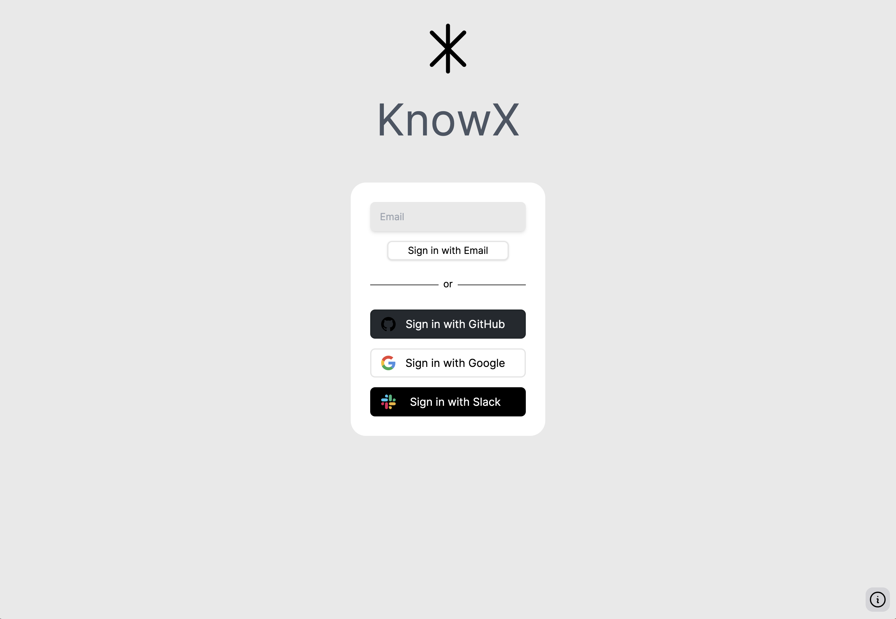
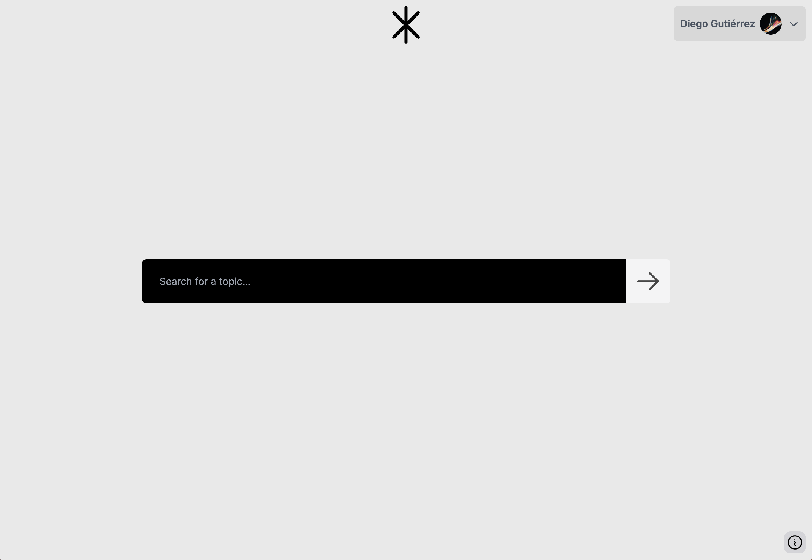
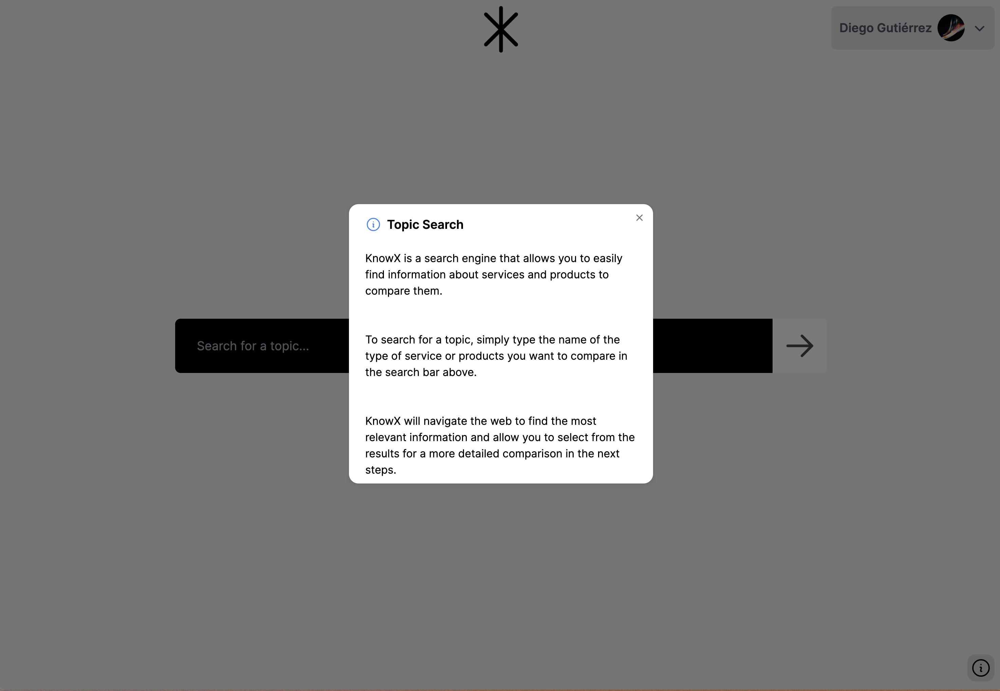
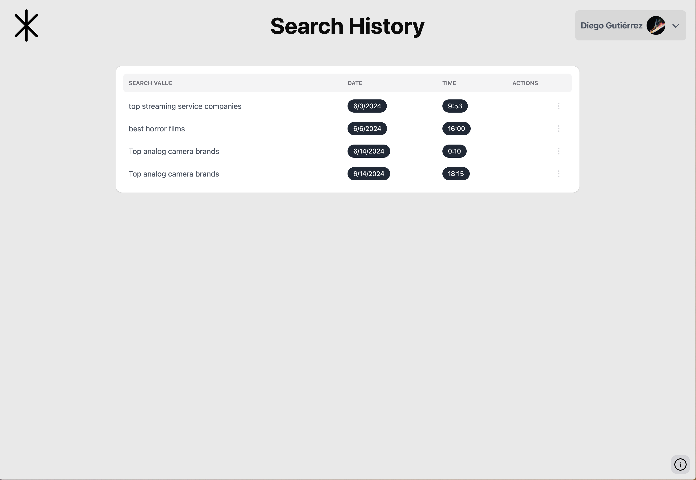
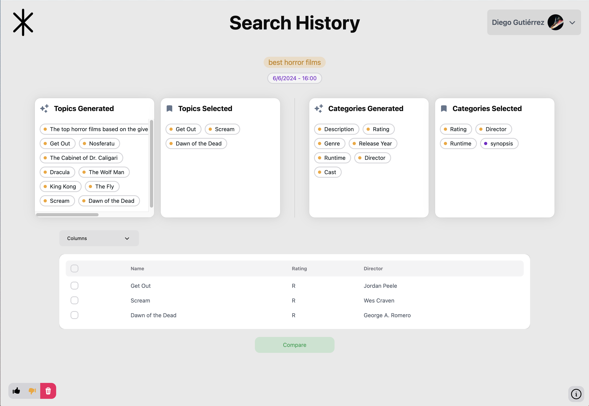
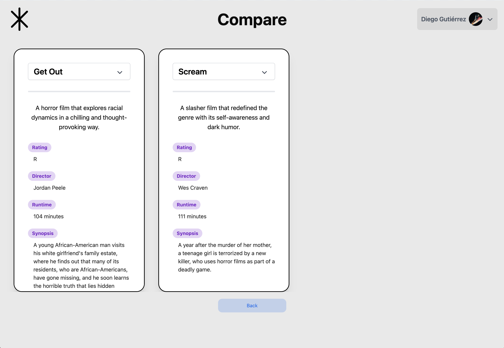
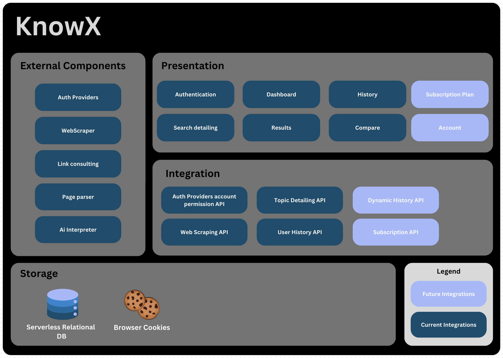
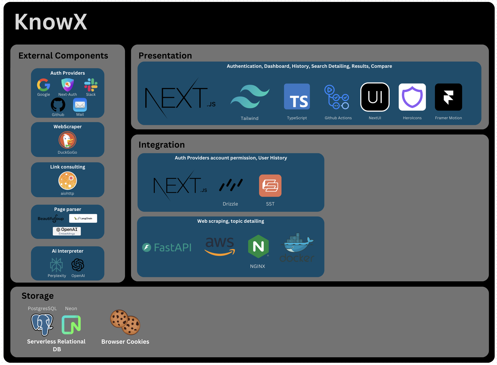

# [KnowX](https://dnutds2j3jjcr.cloudfront.net/)

KnowX es una aplicación web que permite a los usuarios buscar información para comparar sobre un tema específico. La aplicación utiliza varios métodos de web scraping y AI para buscar y analizar información relevante. El usuario puede ver y comparar los resultados para generar una mejor opinion acerca de los productos y/o servicios.

<video width="370" height="260" controls>
  <source src="wiki_assets/KnowX.mov" type="video/mp4">
</video>

## Funcionalidades

- **Búsqueda de información**
- **Especificación de búsqueda**
- **Comparación de información**
- **Historial de búsquedas**

<div class="flex">
  
  
  
  
  
  
</div>

## Arquitectura

<div class="flex">
  
  
</div>

### Estructura de directorios

- **/api** - Código fuente del servicio de AI
- **/knowx** - Código fuente del monolito de la aplicación

## WIKI

Para más información sobre la aplicación, visita nuestra [Wiki](https://github.com/wizelineacademy/itesm-socioformador-feb-jun-2024-Croods/wiki)

## Autores

```
Roberto José García Ríos - A01284731
Diego Gutiérrez Treviño	-	A01284841
Carolina Nicole González Leal	- A01284948
Sofía Cantú Talamantes - A01571120
Ozner Axel Leyva Mariscal	- A01742377
```
